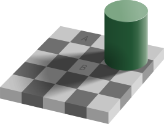

# Seeking Human Bias With Word Embeddings

June 2021, Taavi Kivisik

## Introduction

There is a growing frustration with the lack of abstraction and generalization of artificial neural networks (ANN). While performance in computer vision tasks keeps improving, the improvement does not come from models understanding what is on the image (Jo and Bengio, 2017), but rather from more efficient use of surface level statistical regularities. Adversarial examples where changing a few pixels makes the model predict a wrong class with high confidence (e.g. Szegedy et al., 2015) is a great example of the lack of understanding in artificial intelligence (AI) models.

This lack of abstraction and generalization is in stark contrast with what humans are capable of. Humans demonstrate abstract thinking and pattern recognition by solving math problems, writing poetry, composing music, as well as by understanding analogies and metaphors. These skills rely on combining relevant ideas together in novel but plausible ways. This plausibility can also be thought of as a sense of compatibility with the rest of the patterns we have recognized about the world.

Humans seem to be so tuned for patterns that we can not seem to stop even when we want to. This is true on a perceptual level (e.g. we can not stop seeing the squares A and B as being of different color on Figure 1) as well as on a cognitive level (e.g. a literature review by Furnham and Boo (2011) of the anchoring effect reveals that even expertise does not eliminate the effect of anchoring). Humans are also bad at generating random numbers, saying the same digit twice in a row 7.57% of the time (10% expected for a fully random sample) and having the next digit one higher than the previous one 15.44% of the time (9% expected for a fully random sample (Figurska et al., 2008).

|  |
|:--:|
| <b>Figure 1. Checker illusion</b> - squared A and B are objectively of the same color, but due to the peculiarities of the human perceptual system, we perceive them as clearly different. Original: Edward H. Adelson, vectorized by Pbroks13 (Wikimedia).|

In this study I propose to see human bias as a feature at least from the generalization perspective, and use it to explore word embeddings. More precisely, I analyze data where human participants were asked to come up with 10 words semantically as far apart from each other as possible. This project contributes to the debate about the abstraction and generalization in ANNs by studying whether human bias can be detected using word embeddings in order to pave the way for AI systems inspired by the only known great generalizers, humans.

I propose to test an alternative hypothesis stating that when humans are asked to say words that are semantically as far apart as possible, then these words will be closer together in a word embedding space than any random two words.

## Method

### Data

Data used in this project was originally collected for a study by Uibopuu and Aru with colleagues (2021). They asked participants to write down 10 words in Estonian that are semantically as far apart from each other as possible. Hele-Andra Kuulmets exported these data in a tabular format and developed a basic distance metric.

After removing pilot participants, there were a total of 139 unique users participating in a total of 728 sessions. They used a total of 7085 words in complete sessions (where none of the 10 words was unknown), and 2216 of them were unique.

### Word embeddings

I used pretrained 100 dimensional word embeddings from [Eesti Keeleressursside Keskus](https://entu.keeleressursid.ee/shared/7540/I7G5aC1YgdInohMJjUhi1d5e4jLdhQerZ4ikezz1JEv3B9yuJt9KiPl9lrS87Yz0). Embeddings trained on whole words were used instead of lemmas as the former led to a lesser loss in creativity data (less unknown words). Skip-gram (sg) as a word2vec algorithm was used instead of continuous bag-of-words (cbow) as the former handles rare words better.

### Approach

Looking into human word sequences I get a sample of words that are considered distant by humans. An example sequence could have been "police, cardboard, bile, moto, lottery, photo, mug, bass, mass, balcony" (in Estonian). This allows me to construct two word pair conditions:
* Human pairs - where the two words were said consequently by a human (e.g. police, cardboard)
* Random pairs - where the two words are chosen at random from a pool of all words used by humans in this study (e.g. police, bile; police and some word from another sequence)

I then compare metrics like an average Euclidean distance and cosine similarity between these two words. The alternative hypothesis is that
* humans jump shorter distances between consecutive words compared to random words combined by a computer.

## Results

Welch t-test comparing the Euclidean distance between human pairs and random pairs conditions was performed ($n=6180, t=-1.9970, p=0.0467$). With the significance level $\alpha=0.05$, we can reject the null hypothesis and claim there is a statistically significant difference between Euclidean distances of human word pairs and random word pairs. As the Welch t-test was performed two-tailed despite the directional expectation, confidence in the alternative hypothesis is even stronger.

The same two-tailed Welch t-test comparing the two human pairs and random pairs conditions was performed using cosine similarity ($n=6180, t=2.2188, p=0.0265$). With the significance level $\alpha=0.05$, we can reject the null hypothesis once again. Therefore, we can proceed with the alternative hypothesis that there is a statistically significant difference in cosine similarity between human word pairs and random word pairs. As the t-value is positive, the human pairs has a higher average cosine similarity.

## Discussion

The analysis allowed us to confirm the stated alternative hypotheses that human word pairs are closer together (Euclidean distance) and more similar to eachother (cosine similarity) compared to random word pairs. On the one hand, that was what we expected. humans are not only bad random number generators, but also bad distant word sequence generators. On the other hand, it raises the question of the validity of using these distance metris and word embeddings as a measure of semantic distance. I will later discuss potential upgrades to the initial word task where the data was collected from.

### Subjective Distance not Captured

Humans consider human word pairs distant as the task was to create semantically distant word sequences and therefore the criterion for including a word must have been a sense of distance. For some reason, that subjective distance does not translate to a distance measured with Euclidean distance or cosine similarity on word embeddings. This discrepancy can arise from using wrong distance metrics, or that the word embeddings model semantic space in a fundamentally different way compared to humans.

The semantic space was represented using word embeddings rather than a semantic graph (e.g. WordNet). It is possible that measuring distance in that embedding space is too unbiased - one can jump directly from any thought to another. Humans on the other hand seem to move from one thought to another by association which could be better modelled using geodesic distance on a graph. Semantic graph would keep words with similar meaning close together. Rarer words would be associated with fewer contexts and therefore with fewer words, leading to a more biased (restricted) model of a semantic space. This should be detectable also using shortest path as distance.

Another approach to capture human semantic distance would be to use other distance metrics or come up with new ones to be used with word embeddings. For example, instead of measuring direct Euclidean distance from a word A to a word B, measure it through a third point C. That third point C could be a point where a normalized word vector would be 0 in all features, representing the most neutral point in vector space. That third point could instead be a word most central in the normalized word vector space, representing a most probable semantic hub - a possible estimation of a semantic graph center.

### Word Sequences

Even though I consider it fair to assume that any two consecutive words in a sequence of distant words are also distant, it could be that the assumption might be false for some sessions and strategies. For example, if a participant aimed to come up with widely differing 7 first words and then fill the remaining 3 with whatever comes to mind. This would lead to the last 2-3 pairs to probably being closer to one another than the rest of the words.

One way to tackle this problem for good would be to change the original task to ask for 4-5 distant words rather than 10. This would be more in line with the human working memory capacity depending on the task measured to be either $7\pm2$ (Miller, 1956), or $4\pm1$ (Cowan, 2010). In our case, the word sequences as a whole could be more valid if participants had the capacity to compare potential new words to be added to the sequence with all the other words they have said before.

## Conclusion

What is distant for humans is not distant in word embeddings. That is, when humans are asked to express a sequence of 10 semantically distant words, consecutive word pairs fail to be more distant than random word pairs when measured using Euclidean distance or cosine similarity. These findings inspire future research into appropriate distance metrics on word embeddings when the goal is to better align word embeddings and human semantic memory. Also, using graphs (e.g. SemanticWeb) instead of word embeddings could be a fruitful alley of research for better aligned word distances in humans and AI systems.

## Contributions

Data was collected by Oliver Uibopuu, basic transformation into a table by Hele-Andra Kuulmets. My contribution was literature overview, data preprocessing, analysis, and writing up the blog.

I thank my supervisor Jaan Aru.